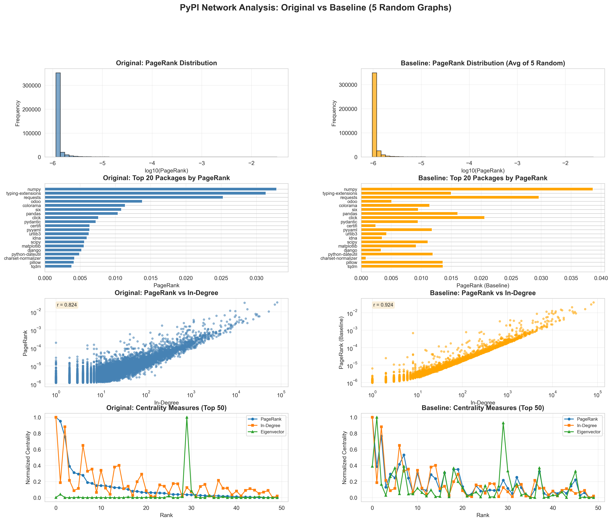

# Objective 1: Identification of Core Packages in the PyPI Ecosystem

## Research Question

**Which packages are most critical to the pypi ecosystem's function and stability?**

---

## Executive Summary

Using PageRank as the primary centrality measure, we identified the most critical packages in the PyPI dependency network. Our analysis of **397,798 active packages** with **1,819,937 dependency relationships** reveals that the ecosystem exhibits extreme centralization, with a small number of foundational packages supporting the vast majority of the ecosystem. **NumPy** emerges as the single most critical package, followed by **typing-extensions**, **requests**, **odoo**, **colorama** etc.       
with a PageRank score 6,253× higher than the average package.

---

## Methodology

### Dataset Characteristics

- **Total Packages**: 698,903 packages in the complete dataset
- **Active Packages**: 397,798 packages with at least one dependency relationship
- **Edges**: 1,819,937 directed dependency edges
- **Graph Type**: Directed Acyclic Graph (DAG) - all cycles removed
- **Density**: 0.000012 (really sparse network)

### Centrality Measures

We computed five complementary centrality measures:

1. **PageRank (Primary Metric)** - Parameters: α=0.85, max_iter=100, tol=1×10⁻⁶
   - Captures transitive importance in the dependency graph
   - Accounts for both direct and indirect dependents
   - Higher score indicates more fundamental/critical package

2. **In-Degree Centrality** - Normalized count of direct dependents
   - Measures immediate ecosystem impact
   - High correlation with PageRank (r=0.82)

3. **Out-Degree Centrality** - Normalized count of dependencies
   - Indicates package complexity and coupling
   - Low correlation with importance metrics

4. **Eigenvector Centrality** - Influence based on neighbor importance
   - Similar to PageRank but undamped
   - Identifies packages connected to other important packages

5. **Betweenness Centrality** - Frequency on shortest paths (k=5000 sample)
   - Identifies "bridge" packages connecting communities
   - Moderate correlation with PageRank (r=0.39) and stronger correlation with in-degree (r=0.58)

---

## Key Findings

### 1. The Top 10 Core Packages

| Rank | Package | PageRank | Direct Dependents | Dependencies | Interpretation |
|------|---------|----------|-------------------|--------------|----------------|
| 1 | **numpy** | 0.03286 | 81,923 | 0 | Scientific computing foundation |
| 2 | **typing-extensions** | 0.03135 | 15,444 | 0 | Type hints for Python 3.5-3.10 |
| 3 | **requests** | 0.02528 | 72,340 | 4 | HTTP library backbone |
| 4 | **odoo** | 0.01384 | 17,859 | 0 | ERP framework |
| 5 | **colorama** | 0.01139 | 7,372 | 0 | Cross-platform colored terminal |
| 6 | **six** | 0.01087 | 9,643 | 0 | Python 2/3 compatibility |
| 7 | **pandas** | 0.01038 | 53,306 | 4 | Data analysis library |
| 8 | **click** | 0.00760 | 27,115 | 1 | CLI creation framework |
| 9 | **pydantic** | 0.00725 | 29,279 | 4 | Data validation library |
| 10 | **certifi** | 0.00638 | 5,572 | 0 | SSL certificate bundle |

**Key Observation**: NumPy dominates with 81,923 direct dependents (20.6% of all active packages). It has **zero dependencies**, making it a true foundational package with no upstream risk.

### 2. Extreme Centralization of Importance

The PageRank distribution reveals extreme concentration:

- **Top 10 packages**: Average PageRank = 0.0157 (6,253× overall average)
- **Top 100 packages**: Average PageRank = 0.0033 (1,329× overall average)
- **Overall average**: 0.0000025

This indicates a **"winner-takes-all" structure** where a tiny fraction of packages (<0.003%) carries the majority of the ecosystem's weight.

### 3. Package Categories in Top 50

Core packages span infrastructure (HTTP, CLI, security), data science (numpy, pandas, scipy), and developer tooling (pytest, setuptools).

Top 50 packages by category:

- **ML/AI & Scientific Computing** (7): numpy, scipy, pandas, scikit-learn, matplotlib, torch, mcp
- **Web/HTTP** (6): requests, urllib3, httpx, aiohttp, flask, django
- **Type System/Compatibility** (3): typing-extensions, six, typing-inspection
- **Data Validation/Parsing** (5): pydantic, pyyaml, lxml, beautifulsoup4, cffi
- **CLI/Terminal** (4): click, colorama, tqdm, rich
- **Security/Crypto** (3): certifi, cryptography, idna
- **Testing/Dev Tools** (3): pytest, setuptools, packaging
- **Cloud Services** (2): boto3, botocore

### 4. Correlation Analysis

Strong correlation between PageRank and In-Degree Centrality (r=0.82) confirms that packages with many direct dependents also have high transitive importance. However:

- **Out-degree has near-zero correlation** (r=-0.004) with PageRank, indicating that having many dependencies does NOT make a package more important
- **Betweenness centrality shows moderate correlation** (r=0.39) with PageRank and stronger correlation (r=0.58) with in-degree, suggesting that bridge packages tend to be those with many direct dependents

### 5. Network Structure Insights

- **306,925 packages** (77.2%) have in-degree = 0 (no dependents) - these are "leaf" packages
- **20,742 packages** (5.2%) have out-degree = 0 (no dependencies) - foundational packages
- **Largest weakly connected component**: 394,343 nodes (99.1% of active packages)
- **All SCCs have size 1**: Confirms true DAG structure (no circular dependencies)

---

## Visual Analysis

### Plot Interpretation

#### **Top-Left: PageRank Distribution (Log Scale)**
The histogram shows an extremely right-skewed distribution:
- **Massive concentration** at log₁₀(PageRank) ≈ -5.9 (most packages)
- **Long right tail** extending to -1.5 (elite packages)
- This power-law-like distribution is characteristic of scale-free networks
- **Interpretation**: The vast majority of packages have minimal importance, while a tiny elite has disproportionate influence

#### **Top-Right: Top 20 Packages by PageRank**
As analyzed above
Clear hierarchy visible:
- **NumPy dominates** with ~0.033 PageRank
- **Sharp drop-off** after top 3 (numpy, typing-extensions, requests)
- **Gradual decline** from rank 4-20
- **Interpretation**: Even among the elite, there's a clear stratification of importance

#### **Bottom-Left: PageRank vs In-Degree (Log-Log Scale)**
Strong positive correlation visible:
- **Linear relationship** on log-log scale suggests power-law
- **Tight clustering** along the diagonal
- **Some outliers** above the trend line (packages with high PageRank relative to in-degree)
- **Interpretation**: Direct dependents (in-degree) is a strong predictor of overall importance (PageRank)

#### **Bottom-Right: Centrality Measures Comparison (Top 50, Normalized)**
Comparing three measures for top 50 packages:
- **PageRank (blue)** and **In-Degree (orange)** track closely for top packages
- **Betweenness (green)** shows different pattern with spikes at specific packages
- Notable divergence: Some packages have high betweenness but lower PageRank (e.g., ranks 20-30)
- **Interpretation**: While PageRank and in-degree identify similar core packages, betweenness reveals additional "bridge" packages that connect different parts of the ecosystem

---

## Answering the Research Question

### **Which packages are most critical to the ecosystem's function and stability?**

Based on our PageRank analysis, the **most critical packages** are:

#### **Tier 1: The Foundation (Top 3)**
1. **NumPy** - The single point of failure for the entire scientific Python ecosystem (81,923 direct dependents)
2. **typing-extensions** - Enables modern Python type hints across versions (15,444 direct dependents)
3. **requests** - The de facto HTTP library AND the most critical bridge package (72,340 direct dependents, highest betweenness=0.0000032)

These three packages collectively support over 169,607 direct dependents (42.6% of the ecosystem). Notably, **requests** serves dual critical roles: high PageRank (transitive importance) AND highest betweenness (bridge connecting communities).

#### **Tier 2: Major Infrastructure (Ranks 4-10)**
- **odoo, pandas, click, pydantic** - Major frameworks and libraries
- **colorama, six, certifi** - Cross-cutting compatibility and infrastructure

#### **Tier 3: Domain Leaders (Ranks 11-50)**
- **Scientific**: scipy, matplotlib, scikit-learn, torch
- **Web**: django, flask, urllib3, httpx, aiohttp
- **Security**: cryptography
- **Data**: pyyaml, lxml, beautifulsoup4

### **Why These Packages?**

1. **High Transitive Impact**: Through PageRank, we capture not just direct dependents but the cascade effect - packages that support other important packages receive higher scores

2. **No or Minimal Dependencies**: NumPy (0), typing-extensions (0), certifi (0) have zero dependencies, making them stable foundations

3. **Cross-Domain Utility**: These packages serve multiple domains (DS/ML, web, CLI, security), making them universal infrastructure

4. **Network Position**: High in-degree combined with position in dependency chains creates structural criticality

---

## Implications for Ecosystem Stability

### **Vulnerability Assessment**

1. **Single Point of Failure Risk**: NumPy's failure would cascade to 81,923 packages directly and potentially 300,000+ transitively

2. **Maintenance Burden**: The top 10 packages carry enormous responsibility with limited maintenance resources

### **Resilience Considerations**

1. **Foundational packages** (NumPy, typing-extensions) have minimal upstream dependencies, reducing supply chain risk

2. **Diverse package categories** in top 50 suggest no single domain dominates vulnerability

3. **Strong correlations** between centrality measures (PageRank-InDegree: r=0.82, InDegree-Betweenness: r=0.58) suggest centrality measures are robust and agree on core packages

4. **Bridge packages**: With k=5000 sample betweenness, we identified **requests** as the most critical bridge package, connecting different technology stacks and communities within the ecosystem

---

## Conclusions

1. **Extreme Centralization**: The PyPI ecosystem exhibits a "hub-and-spoke" structure with a tiny core supporting the vast majority of packages

2. **NumPy's Dominance**: NumPy is uniquely critical - it supports 20.6% of all active packages directly and many more transitively

3. **Predictable Importance**: PageRank and in-degree centrality strongly agree (r=0.82), suggesting robust identification of core packages

4. **Category Diversity**: Core packages span scientific computing, web infrastructure, developer tools, and security - no single domain monopolizes criticality

5. **Stability Through Simplicity**: The most critical packages tend to have few or zero dependencies, creating stable foundations

6. **Bridge Package Identification**: With betweenness sampling (k=5000), **requests** emerges as the most critical bridge package (betweenness=0.0000032), despite being rank 3 by PageRank. This highlights its unique position in connecting different parts of the ecosystem.

---

## Limitations

1. **Betweenness approximation**: Used k=5,000 sample for computational efficiency; full computation on 397K nodes would be prohibitively expensive (O(n³) complexity)

2. **Snapshot analysis**: Dataset from (ask Omer about pypi snapshot time)??; ecosystem evolves rapidly

3. **Ignores version constraints**: Our abstraction treats all version dependencies equally

---

## Comparism with baseline

We construct a degree-preserving DAG null model via ordered edge swaps. This null model preserves each package’s in-degree, out-degree, and position in the dependency hierarchy, while randomizing the specific dependencies.

Because this null model is highly constrained, we expect centrality distributions to be similar between the real and randomized networks. The relevant question is not ‘do the plots look different’, but which nodes deviate significantly from their random expectation and how the relationship between degree and centrality changes.

In the randomized networks, PageRank is almost entirely explained by in-degree (r = 0.924). In contrast, in the real network the correlation is significantly lower (r = 0.824), indicating additional structural factors.

Key packages (typing-extensions, odoo, etc.) have PageRank values several standard deviations above the null expectation, confirming that their importance cannot be explained by degree alone.

